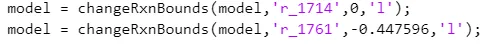
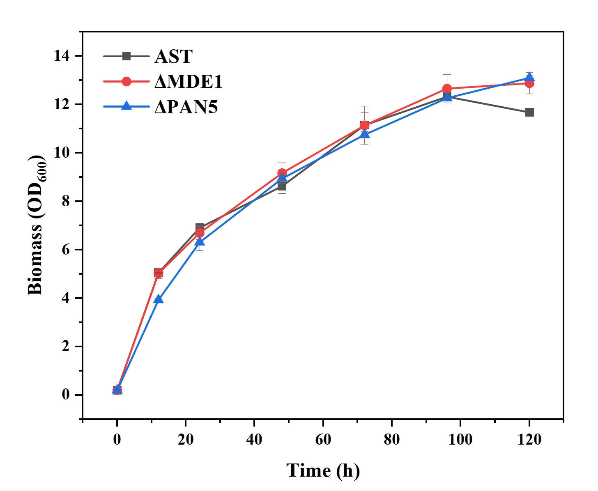
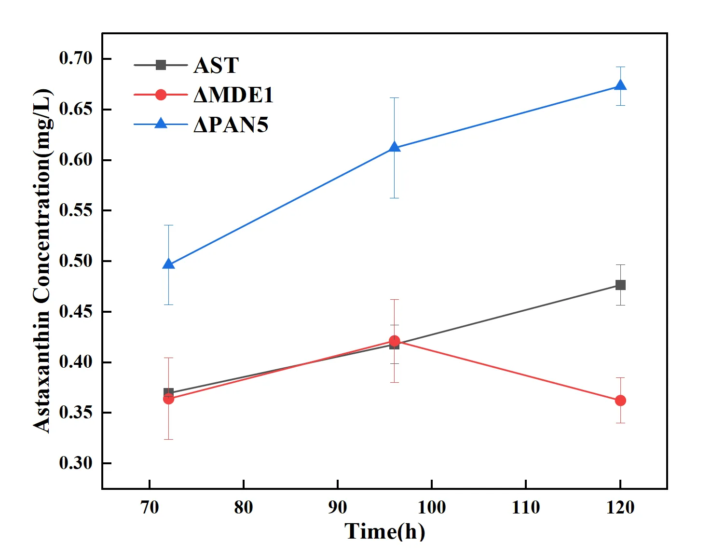

# GSMM 模型记录证据摘录

本页整理团队连续研究过程中与 FABRIC-AI 生产优化闭环直接相关的模型文本和图片，使结构化记录能够回到公开证据。

## 1. 模型输入与候选筛选

记录以 Yeast9 为基础构建 astaxanthin 生产模型，将初始发酵得到的生长、乙醇消耗和产物形成信息写入模型。两项速率为：

- 乙醇消耗速率：0.447596 mmol/(gDCW·h)；
- astaxanthin 合成速率：0.000193873 mmol/(gDCW·h)。

模型记录给出的候选反应数量为 307。当前公开材料没有 307 条逐项反应清单。

## 2. 记录的 14 个方案

Plan1–Plan14 是方案标识符。每张图中的 `obj` 值已逐项转录；目标函数定义未恢复，跨方案可比性未建立，当前记录不据此形成排序。

| 方案标识符 | 反应 | `obj` 转录值 | 证据图 |
|---|---|---:|---|
| Plan1 | r_0015 | 0.0067 | [查看](figures/img-020-0015.webp) |
| Plan2 | r_0525 | 0.0067 | [查看](figures/img-021-0525.webp) |
| Plan3 | r_0014 | 0.0067 | [查看](figures/img-022-0014.webp) |
| Plan4 | r_0967 | 0.0067 | [查看](figures/img-023-0967.webp) |
| Plan5 | r_0968 | 0.0067 | [查看](figures/img-024-0968.webp) |
| Plan6 | r_0086 | 0.0025 | [查看](figures/img-025-0086.webp) |
| Plan7 | r_0019 | 0.0025 | [查看](figures/img-026-0019.webp) |
| Plan8 | r_0145 | 0.0025 | [查看](figures/img-027-0145.webp) |
| Plan9 | r_0075 | 0.0025 | [查看](figures/img-028-0075.webp) |
| Plan10 | r_0905 | 0.0067 | [查看](figures/img-029-0905.webp) |
| Plan11 | r_0452 | 0.0060 | [查看](figures/img-030-0452.webp) |
| Plan12 | r_0087 | 0.0025 | [查看](figures/img-031-0087.webp) |
| Plan13 | r_0906 | 0.0067 | [查看](figures/img-032-0906.webp) |
| Plan14 | r_0843 | 0.0067 | [查看](figures/img-033-0843.webp) |

## 3. 六个实验靶点

页面文字说明通过代谢通路分析和文献证据复核形成六个靶点。该陈述适用于候选集合层级；靶点级通路位置、预期碳流影响和逐项文献依据未恢复。

| 靶点 | 反应 | 通路位置 | 预期作用 | 现有证据 | 证据状态 |
|---|---|---|---|---|---|
| RIB2 (YOL066C) | r_0014 | not_recovered | not_recovered | 六靶点集合由代谢通路分析与文献证据复核形成 | page_level_only |
| PAN5 (YHR063C) | r_0019 | not_recovered | not_recovered | 六靶点集合由代谢通路分析与文献证据复核形成 | page_level_only |
| MDE1 (YJR024C) | r_0086 | not_recovered | not_recovered | 六靶点集合由代谢通路分析与文献证据复核形成 | page_level_only |
| MRI1 (YPR118W) | r_0087 | not_recovered | not_recovered | 六靶点集合由代谢通路分析与文献证据复核形成 | page_level_only |
| SPE2 (YOL052C) | r_0145 | not_recovered | not_recovered | 六靶点集合由代谢通路分析与文献证据复核形成 | page_level_only |
| FUM1 (YPL262W) | r_0452 | not_recovered | not_recovered | 六靶点集合由代谢通路分析与文献证据复核形成 | page_level_only |

该矩阵支持从 14 个方案形成六靶点集合的阅读追踪。当前材料未恢复靶点特异的通路位置、预期碳流作用和逐项文献依据，因此不补写机制细节。

## 4. Round 1 验证与规则输出

ΔPAN5 与 ΔMDE1 获得定量发酵曲线；其余四个靶点在本轮 HIS 缺失培养条件下记录为可实施性未通过。该分类不表示基因致死或必需。

同批次 120 h 时，AST 约 0.47 mg/L，ΔPAN5 约 0.67 mg/L；ΔMDE1 在 96 h 约 0.42 mg/L，120 h 约 0.36 mg/L。`feedback_rules.json` 由这些记录计算 PAN5 tier 1、MDE1 tier 2 和四项 tier 3，并保存判定轨迹与下一轮设计方向。证据 Tier 不代表靶点名次。

## 5. 可复核范围

本摘录支持方案编号与 `obj` 转录、靶点映射、实验输入和 Round 1 规则反馈的追溯。当前材料不包含可执行模型文件，不能在本仓库中重跑原始 Yeast9、FBA 或 OptKnock 环境。