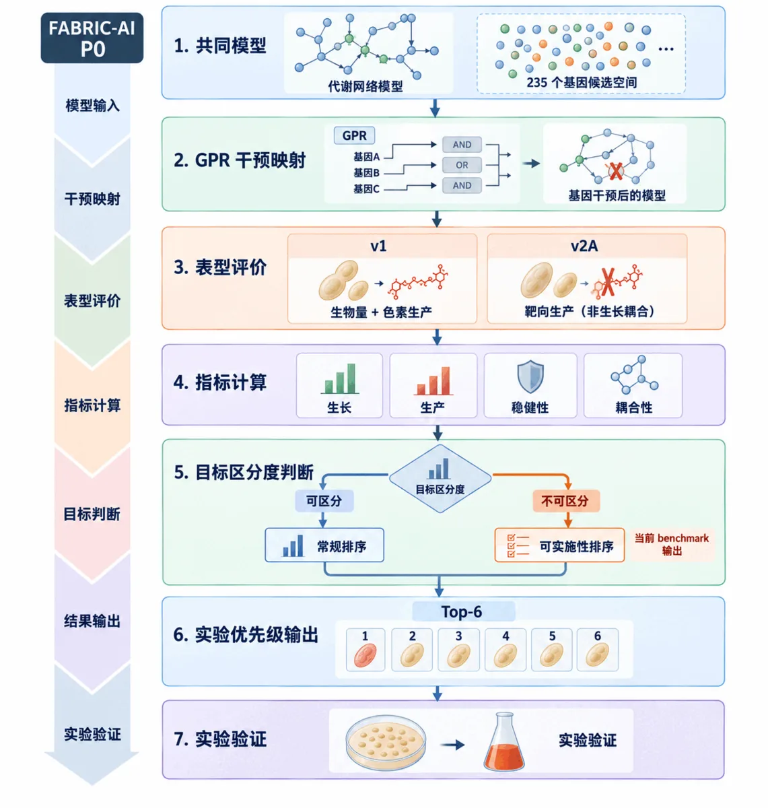

<div align="center">

# AI / 计算方法

**FABRIC-AI Production Optimizer v1.2**

`235-gene 全空间评价` · `近三年公开基线` · `多条件稳健性` · `Design / Learn 分离`

</div>

<div align="center">

[← Wiki 首页](./Home.md) · [四方法 Benchmark](#2-四方法-benchmark) · [方法细节](#3-fabric-ai-production-optimizer-v12) · [干湿闭环](./Integrated-Validation.md) · [复现](./Verifiability.md)

</div>

> **一句话结论**：公开基线主要完成候选搜索；FABRIC-AI 在统一的 corrected 235-gene 单基因空间中进一步完成 **235/235 全量表型评价、同一候选空间的生产阶段敏感性分析、目标区分度检测和确定性实验优先级整理**。

| 主条件评价 | 生产阶段敏感性 | 公开基线 | 计算质量控制 |
|:---:|:---:|:---:|:---:|
| **235 / 235** | **235 / 235** | **3 种近期方法** | **0 footprint mismatch / 0 solver failure** |

---

## 1. 共同任务与冻结输入

共同任务定义为：**在统一酵母代谢模型和统一单基因敲除空间中，评价每个候选的生长—生产表型，并形成可进入湿实验的优先级决策。**

共同模型基于 Yeast-GEM v9.1.0，并加入 FABRIC 项目的异源产色通路。最终冻结的单基因可实施空间包含 **235 个基因**，生物量反应为 `r_2111`，目标产物反应为 `FABRIC_r_4799`，数值容差统一为 `1e-7`。

| 条件 | 角色 | 是否进入正式比较 | 用途 |
|---|---|:---:|---|
| `v1_glucose_reference` | **Primary condition** | **是** | 候选准入与共享 benchmark |
| `v2a_historical_ethanol_stage` | 生产阶段敏感性 | 是，作为稳健性报告 | 对同一 235-gene primary pool 再评价 |
| `v2b_vitamin_availability_*` | 培养基机制诊断 | 否 | 研究营养可获得性对候选准入的影响 |

> **数据边界**：历史 Round 1 的 PAN5、MDE1 等实验结果不进入 Design mode 的候选生成、阈值或排序。实验结果仅在 Design mode 冻结后进入 Learn mode。

<p align="center">
  
</p>
<p align="center"><em>FABRIC-AI P0 计算流程：共同模型与 235-gene 候选空间经 GPR 干预映射、多条件表型评价和目标区分度判断后形成实验优先级输出。</em></p>

---

## 2. 四方法 Benchmark

### 2.1 近期公开基线

本轮选择三种 2023–2024 年公开的菌株优化方法：

| 方法 | 年份 | 原生任务 |
|---|---:|---|
| **FastKnock** | 2024 | growth-coupled knockout search |
| **CFSA** | 2024 | comparative flux sampling 与干预发现 |
| **OptEnvelope** | 2023 | production-envelope guided reaction-set design |

共同 benchmark 统一使用 corrected v1 模型和 corrected 235-gene 单基因空间。公开方法保留各自原生输出；能够映射到真实单基因敲除的结果，再进入共享 gene-level 独立评价。

来源：FastKnock — Hassani et al., 2024；CFSA — van Rosmalen et al., 2024；OptEnvelope — Motamedian et al., 2023。

### 2.2 冻结结果

| 方法 | 本轮 gene-level 输出 | 235-gene 空间表型覆盖 | Guaranteed-production 结果 | 面向实验的输出 | 正式运行时间 |
|---|---:|---:|---|---|---:|
| FastKnock 2024 | 0 个合法 native gene candidate | 0 / 235 | 无候选，质量指标 N/A | 未形成候选列表 | 9.912 s |
| CFSA 2024 | 14 个合法单基因 KO | 14 / 235 = 5.96% | 0 / 14 出现正 `Pmin` | 14 个映射 KO | ≤1416.77 s |
| OptEnvelope 2023 | 11 个 target point 完成；0 个可映射 gene row | 0 / 235 | gene-level 指标 N/A | 未形成可映射单基因列表 | 3114.15 s |
| **FABRIC-AI v1.2** | **235 / 235 基因完成显式表型计算与确定性排序** | **v1：235 / 235；v2A：同一 235 / 235** | **自动识别 `NON_DISCRIMINATING_GUARANTEED_PRODUCTION`** | **完整 phenotype table + 可实施性 Top-6** | **635.91 s** |

运行时间用于记录正式执行成本和复现环境；四种方法的原生工作负载不同。

<p align="center">
  
</p>
<p align="center"><em>统一 235-gene 空间中的表型评价覆盖率。Coverage 表示完成显式 phenotype evaluation 的候选比例，不代表增产成功率。</em></p>

完整冻结表：[`FOUR_METHOD_BENCHMARK_FINAL.md`](../results/baseline/20260908/FOUR_METHOD_BENCHMARK_FINAL.md)

### 2.3 Benchmark 给出的核心判断

FastKnock 在 corrected 235-gene 任务上返回 0 个合法候选；CFSA 映射得到 14 个单基因 KO；OptEnvelope 修正版完成 11 个目标点后没有形成可映射 gene-level 输出。FABRIC-AI 对 **235 / 235 个可实施基因**完成主条件表型计算，并对同一 235-gene primary pool 在 v2A 乙醇生产阶段条件下再次评价。

在 primary condition 中，235 个候选的 GCP 与 Pmin95 均为 0。系统据此识别 guaranteed-production 指标已经失去区分能力，并进入预先冻结的可实施性决策层。这个结果把“**当前优化目标是否足以支持候选排序**”本身作为模型输出。

---

## 3. FABRIC-AI Production Optimizer v1.2

### 3.1 Design mode：全空间显式评价

Design mode 对 primary condition 中的 235 个可实施单基因敲除逐一施加完整 GPR 失活集合，并计算统一表型。

| 指标 | 含义 | 在决策中的作用 |
|---|---|---|
| `mutant_mu_max` | 突变体最大生长 | 判断候选是否保持基本可实施性 |
| `Pmin / Pmax` | 10%、50%、90% WT 生长下的产物上下界 | 描述共同生长要求下的生产范围 |
| `Pmin95 / Pmax95` | 近突变体最大生长状态下的产物上下界 | 描述接近最优生长时的生产状态 |
| `GCP` | Guaranteed Coupled Production | 衡量被强制保留的产物下界 |
| `GR` | Growth Retention | 生长保持能力 |
| `PCR` | Product Capacity Ratio | 理论生产能力保留比例 |
| `footprint_size` | 基因敲除导致的失活反应数 | 干预复杂度描述 |

对每个条件 `c`：

`GCP(g,c) = mean_f [ Pmin(g,c,f) / max(Pmax_WT(c,f), 1e-12) ]`

其中 `f ∈ {0.1, 0.5, 0.9}`。跨条件稳健性由 `Robust_GCP = min_c GCP`、`Median_GCP` 和 `Robust_GR = min_c GR` 描述。

### 3.2 目标区分度检测

正式排序前，系统检查 primary condition 的 GCP 与 Pmin95。若全部候选在两个指标上均为 0，则标记：

> **`NON_DISCRIMINATING_GUARANTEED_PRODUCTION`**
>
> 当前 guaranteed-production 目标无法继续区分 235 个候选，系统转入预先冻结的可实施性排序层。

该门禁保证排序不会把 `Pmax` 数值噪声或求解误差重新包装成“增产优势”。

### 3.3 数值等价感知的确定性排序

排序采用固定字典序规则，不设置可事后调整的线性权重：

1. `Robust_GCP` 降序；
2. `Median_GCP` 降序；
3. primary `Pmin95` 降序；
4. `Robust_GR` 降序；
5. primary `PCR@0.1WT` 降序；
6. `footprint_size` 升序；
7. gene ID 字典序。

排序前在原始通量单位应用 `1e-7` 数值等价规则。若 KO 与 WT 的目标差异不超过求解容差，则在排序中视为等价。

最终 secondary experiment-priority set：

| Rank | Gene | 输出范围 |
|---:|---|---|
| 1 | `YAL060W` | `SECONDARY_FEASIBILITY_ORDER_ONLY` |
| 2 | `YBR006W` | `SECONDARY_FEASIBILITY_ORDER_ONLY` |
| 3 | `YBR011C` | `SECONDARY_FEASIBILITY_ORDER_ONLY` |
| 4 | `YBR183W` | `SECONDARY_FEASIBILITY_ORDER_ONLY` |
| 5 | `YBR281C` | `SECONDARY_FEASIBILITY_ORDER_ONLY` |
| 6 | `YCR005C` | `SECONDARY_FEASIBILITY_ORDER_ONLY` |

该列表用于实验资源配置；生产性能评价继续使用独立的 GCP / Pmin95 指标。

### 3.4 Learn mode：湿实验反馈进入下一轮

Design mode 冻结后，湿实验结果进入 Learn mode。版本化反馈规则读取终点产量、96–120 h 持续性、生物量保持和构建/培养可实施性，更新证据等级和下一轮动作。

**Design → Build → Test → Learn** 的完整实例见 [干湿结合验证](./Integrated-Validation.md)。

---

## 4. FABRIC-AI 的方法创新

| 决策能力 | FastKnock | CFSA | OptEnvelope | **FABRIC-AI** |
|---|:---:|:---:|:---:|:---:|
| 统一 gene-level GPR 评价 | 候选子集 | 映射 KO 子集 | 映射子集 | **完整 235-gene 空间** |
| 全候选 phenotype profiling | — | — | — | **235 / 235** |
| 同一 primary pool 的生产阶段敏感性评价 | — | — | — | **235 / 235** |
| Guaranteed-production 区分度检测 | — | — | — | **✓** |
| 显式 non-discrimination gate | — | — | — | **✓** |
| 数值等价感知的确定性排序 | — | — | — | **✓** |
| 固定实验推荐预算 | — | — | — | **Top-k = 6** |
| Design / Learn 分离 | — | — | — | **✓** |
| DBTL 反馈接口 | — | — | — | **✓** |

“—”表示该能力未作为对应公开方法在本次共享 benchmark 中的实现任务。

> **方法创新的核心**：FABRIC-AI 将菌株优化从“候选搜索”扩展为“完整候选空间 → 统一表型 → 跨条件稳健性 → 目标区分度 → 实验优先级 → 湿实验反馈”的可审计决策流程。

---

## 5. 与 P1 / P2 的计算接口

FABRIC-AI 的项目级架构还包含两个实验决策接口：

| 模块 | 输入 | 输出 |
|---|---|---|
| **P1 Material Interface Optimizer** | BmCBP、色素结合、织物/基材实验 | 固色材料优先级与下一轮验证方向 |
| **P2 Color & Light Translator** | PhiReX 红光表征、光参数、硬件状态 | 可执行光输入与颜色—光照映射接口 |

P1 / P2 的湿实验结果与工程迭代见 [湿实验](./Wet-Lab-Experiments.md) 和 [干湿结合验证](./Integrated-Validation.md)。

---

## 6. 复现与证据入口

| 内容 | 入口 |
|---|---|
| 四方法最终比较 | [`FOUR_METHOD_BENCHMARK_FINAL.md`](../results/baseline/20260908/FOUR_METHOD_BENCHMARK_FINAL.md) |
| FABRIC-AI 最终冻结状态 | [`DESIGN_MODE_FINAL_FREEZE.json`](../results/fabric_ai/20260908/DESIGN_MODE_FINAL_FREEZE.json) |
| Production Optimizer 方法规范 | [`FABRIC-AI_Production_Optimizer_SPEC_v1.2.md`](../src/ai/fabric_ai_optimizer/FABRIC-AI_Production_Optimizer_SPEC_v1.2.md) |
| 方法合同 | [`fabric_ai_optimizer_contract_v1.2.json`](../src/ai/fabric_ai_optimizer/fabric_ai_optimizer_contract_v1.2.json) |
| DBTL / HP 证据摘要 | [`DBTL_AND_HP_EVIDENCE.md`](../results/evidence/20260908/DBTL_AND_HP_EVIDENCE.md) |
| 完整复现 | [Verifiability](./Verifiability.md) |

```bash
python -m pip install -r ../src/ai/fabric_ai_optimizer/requirements-frozen.txt
python ../tools/fabric_ai/reproduction_smoke.py --outdir .reproduction/smoke
```

---

<div align="center">

[← Wiki 首页](./Home.md) · [干湿结合验证](./Integrated-Validation.md) · [湿实验](./Wet-Lab-Experiments.md) · [Parts](./Parts.md) · [可验证性](./Verifiability.md)

</div>

*最后更新：2026-09-09*