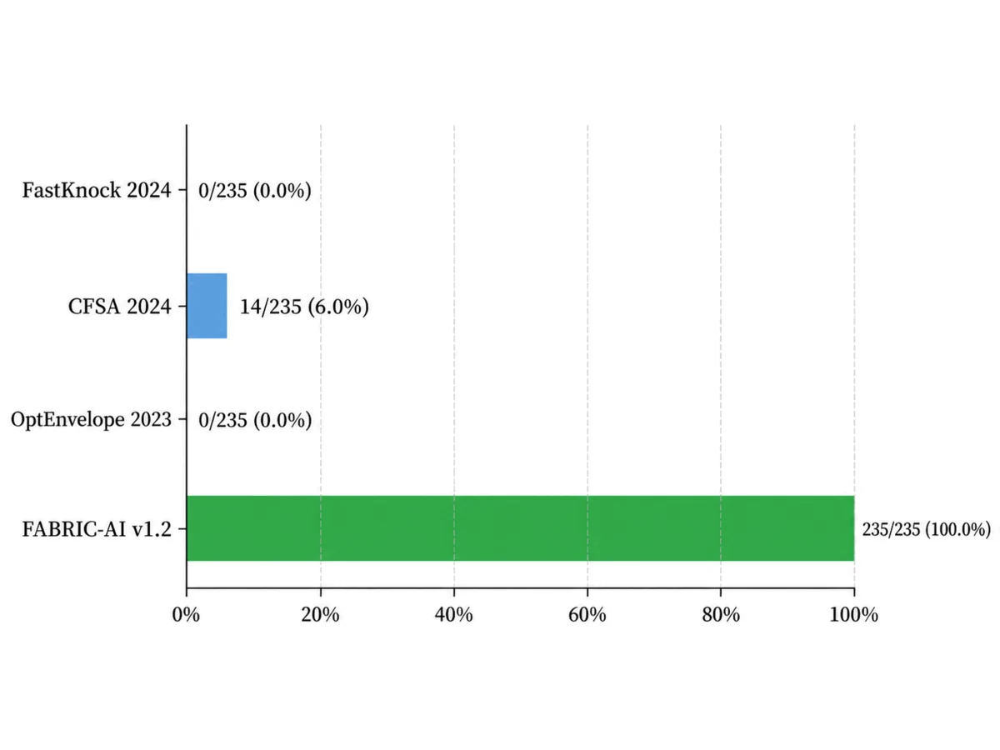

# 光绘酵染 · FABRIC-AI

**工程化酵母产天然色素 · 光响应调控 · BmCBP 固色 · 候选设计与评价**

`BIT-CHINA（045）` · `T3 工业生物制造` · `2026 mAI + 合成生物创新大赛`

> **项目目标**：通过工程化酵母生产天然色素，以 BmCBP 改善色素与织物的结合，以光控表达调节图案。FABRIC-AI 评价候选设计，并根据实验结果更新下一轮实验安排。

  

<em>FABRIC-AI 总体架构：P0 生产优化、P1 材料固色和 P2 光控表达共同连接到实验验证与 DBTL 学习反馈。</em>

| 计算设计空间 | 近期公开基线 | 本届新元件 | 设计与实验迭代 |
|:---:|:---:|:---:|:---:|
| **235 / 235** 个候选完成表型评价 | **3** 种：FastKnock、CFSA、OptEnvelope | **2** 项 AISB26 元件 | **P0 / P1 / P2** 三条主线 |

---

## 评审快速入口

| 内容 | 页面 | 主要结果与资料 |
|---|---|---|
| **AI / 计算方法与近三年基线** | [AI / 计算方法](./AI-Computational-Methods.md) | 四方法基准比较、235 个候选的全部评价、设计/实验反馈分离 |
| **干湿结合闭环** | [干湿结合验证](./Integrated-Validation.md) | `307 → 14 → 6 → 实验验证 → 证据等级更新` |
| **湿实验结果** | [湿实验](./Wet-Lab-Experiments.md) | ΔPAN5 / ΔMDE1、BmCBP、PhiReX |
| **两项新 DNA 元件** | [元件](./Parts.md) | AISB26-045-001、AISB26-045-002 的序列、表征和图谱 |
| **复现与审计** | [可验证性](./Verifiability.md) | 分模块复现、9 项测试、15/15 项核验、SHA-256 |
| **项目影响** | [人类实践](./Human-Practices.md) · [教育与科普](./Education.md) · [团队合作](./Collaboration.md) | 技术设计改变、教育活动、合作队伍的公开记录 |

---

本届工作在团队已有实验、元件与项目成果基础上继续迭代。

## 1. 项目架构

| 模块 | 核心问题 | 已完成工作 | 结果如何进入下一步 |
|---|---|---|---|
| **P0 · 生产优化** | 哪些代谢干预值得进入实验？ | **235 个基因**的表型评价；FastKnock、CFSA、OptEnvelope 近期基线比较；历史筛选得到 `307→14→6` 的实验选靶记录 | 给出实验优先级，并按实验结果更新评价 |
| **P1 · 材料固色** | 如何让天然色素稳定结合织物？ | BmCBP 表达纯化、A480 结合、丝绸/棉/聚酯实验 | 调整材料优先级，提出“蛋白媒染 + 物理保护”固色方案 |
| **P2 · 颜色与光控** | 如何把目标颜色转化为可执行光输入？ | PhiReX 红光表征；硬件连接光参数、传感、图形界面与远程控制 | 用于研究颜色—光照关系并监测光控过程 |

---

## 2. P0 · 从代谢候选到实验决策

### 历史湿实验闭环

Round 0 发酵数据进入 Yeast9/FBA/OptKnock 分析，形成 **307 个候选反应**和 **Plan1–Plan14**。团队结合代谢通路与实验可实施性审核后，确定 `RIB2`、`PAN5`、`MDE1`、`MRI1`、`SPE2`、`FUM1` 六个 Round 1 靶点。

**307 个候选反应 → 14 个方案 → 6 个实验靶点 → Round 1 → 证据等级**

  

<em>P0 的候选收缩与实验反馈链：307 个候选反应 → 14 个方案 → 6 个实验靶点 → 湿实验验证 → 证据更新 → 下一轮设计。</em>

| Round 1 关键结果 | 数值 | 对下一轮的作用 |
|---|---:|---|
| ΔPAN5，120 h | **约 0.67 mg/L** | 同批 AST 约 0.47 mg/L，列为后续重点研究靶点 |
| ΔMDE1，96 → 120 h | **约 0.42 → 0.36 mg/L** | 评价后期产量持续性 |

### 可执行 FABRIC-AI

Production Optimizer v1.2 对 **235 个基因**组成的共同候选集合，在 v1 与 v2A 条件下各完成 **235/235** 表型评价，并与 FastKnock 2024、CFSA 2024、OptEnvelope 2023 完成基准比较。

在主分析条件下，235 个候选的产物通量下界均为 0，该指标无法区分候选。系统随后按预先设定的生长保持、理论产能保留和干预反应数排序；Top-6 用于安排实验优先级。

  

<em>235 个候选的表型评价覆盖率，即完成表型评价的候选比例，不表示增产成功率。</em>

[查看四方法基准比较 →](./AI-Computational-Methods.md)

**实验反馈的定量更新：**沿用 v0.8 反馈规则，六个历史实验靶点的已评定数量由 **0/6→6/6**，下一轮安排分为 **1 项优先推进、1 项机制复核、4 项构建/培养调整**。这一更新记录实验后的决策变化，设计阶段的基准比较结果保持不变。[查看前后对照与复现证据 →](../results/evidence/20260909/C3_1_QUANTITATIVE_ITERATION.md)

---

## 3. P1 · BmCBP 材料接口

BmCBP 路线从功能分析和分子对接进入湿实验。团队表达并纯化密码子优化的截短 BmCBP，对应 UniProt Q8MYA9 第 68–297 位氨基酸。

| BmCBP 浓度 | 平均 A480 | 测量数 |
|---:|---:|---:|
| 0 mol/L | **2.19190** | 3 |
| `5.5×10^-7 mol/L` | **2.00360** | 3 |
| `1.1×10^-6 mol/L` | **1.84980** | 3 |

平均 A480 随 BmCBP 浓度增加而下降，支持 BmCBP 与虾青素结合。丝绸、棉和聚酯的比较用于更新材料优先级，产业反馈进一步推动“**BmCBP 蛋白媒染 + 壳聚糖物理保护**”的双层固色方向。

[查看 BmCBP 元件与表征 →](./Parts.md)

---

## 4. P2 · 颜色、光与硬件

PhiReX 红光实验采用约 `630 nm`、`200 μW/cm²`、2 h 脉冲照射，总培养时间 24 h；培养结束后测量 EGFP 荧光（激发/发射波长 `485/528 nm`）和 OD600。原记录图 12 中 R5、R11、R13 三个编号样品在红光条件下均高于无光对照。

硬件将数字图案转换为空间化或时序化光输入，并通过光传感、图形界面、4G 通信和远程参数调整连接培养状态与光照控制。

[查看 PhiReX 元件与表征 →](./Parts.md)

---

## 5. 关键成果一览

- **四方法基准比较**：FastKnock 2024、CFSA 2024、OptEnvelope 2023 与 FABRIC-AI v1.2 完成统一共同模型下的基准比较；
- **DBTL 研究记录**：`307 → 14 → 6 → Round 1 → 实验反馈 → 证据等级更新`；
- **两项正式 AISB26 元件**：AISB26-045-001 PhiReX、AISB26-045-002 截短 BmCBP；
- **P1 / P2 实验结果**：BmCBP 色素结合/织物实验与 PhiReX 红光表征；
- **可复现计算流程**：分模块复现通过，9 项排序测试及 15/15 项核验通过；
- **人类实践、教育与科普、团队合作**：专家和产业反馈进入技术设计，并保留合作队伍的 Wiki 记录。

---

## 6. 完整 Wiki 导航

| 项目设计与方法 | 实验与验证 | 项目影响与合规 |
|---|---|---|
| [项目描述](./Project-Description.md) | [湿实验](./Wet-Lab-Experiments.md) | [人类实践](./Human-Practices.md) |
| [系统设计](./Design.md) | [干湿结合验证](./Integrated-Validation.md) | [教育与科普](./Education.md) |
| [AI / 计算方法](./AI-Computational-Methods.md) | [工程化循环](./Engineering-Cycle.md) | [团队合作](./Collaboration.md) |
| [元件库贡献](./Parts.md) | [可验证性](./Verifiability.md) | [AI 伦理与安全](./AI-Ethics-Safety.md) |
|  |  | [项目贡献标注](./Attributions.md) |

---

## 7. 队伍信息

- **队伍**：BIT-CHINA（045）
- **项目**：光绘酵染
- **赛道**：T3 工业生物制造
- **队长**：赵博研
- **Primary PI**：胡冰，北京理工大学化学与化工学院
- **公开仓库**：本 GitHub / Gitee 项目仓库

成员贡献、外部来源和 AI 使用范围见 [项目贡献](./Attributions.md) 与 [AI 伦理与安全](./AI-Ethics-Safety.md)。

---

[AI / 计算方法](./AI-Computational-Methods.md) · [干湿结合验证](./Integrated-Validation.md) · [湿实验](./Wet-Lab-Experiments.md) · [元件](./Parts.md) · [可验证性](./Verifiability.md)

*最后更新：2026-09-10（文字修订）*
