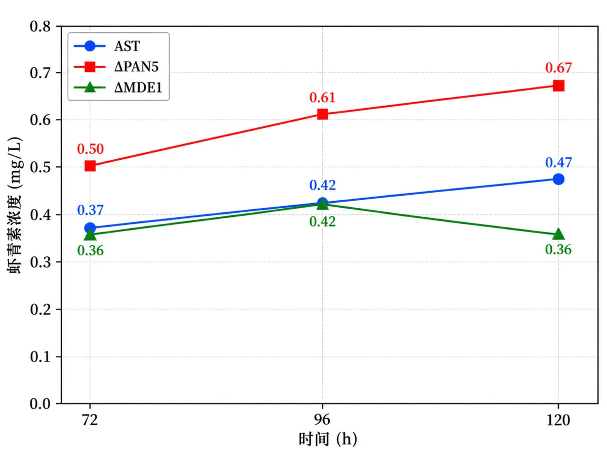

# 干湿结合验证

**Design → Build → Test → Learn**

`P0 生产优化` · `P1 材料接口` · `P2 光控系统`

[← Wiki 首页](./Home.md) · [AI / 计算方法](./AI-Computational-Methods.md) · [湿实验](./Wet-Lab-Experiments.md) · [工程化循环](./Engineering-Cycle.md)

> 计算模型筛选候选，团队审核后开展实验，再根据实验结果调整下一轮安排。P0、P1、P2 分别研究色素生产、材料固色和光控表达。

  

<em>P0 的候选收缩与实验反馈链：307 个候选反应 → 14 个方案 → 6 个实验靶点 → 湿实验验证 → 证据更新 → 下一轮设计。</em>

| 研究模块 | 设计 | 构建与测试 | 实验反馈与下一步 |
|---|---|---|---|
| **P0 生产优化模块** | `307 → 14 → 6` | ΔPAN5、ΔMDE1 定量发酵 + 其余四靶点可实施性记录 | 证据等级与下一轮优先级 |
| **P1 材料固色** | BmCBP 功能分析与分子对接 | 表达纯化、A480、织物/基材实验 | 丝绸优先；双层固色方向 |
| **P2 颜色与光控** | 光控回路与参数设计 | PhiReX 红光表征、硬件迭代 | 光传感、图形界面、4G 与可调整光控接口 |

---

## 1. P0 · FABRIC-AI 生产优化主闭环

### 设计：从发酵记录到 6 个实验靶点

Round 0 发酵数据进入 Yeast9/FBA/OptKnock 分析。历史模型页面记录 **307 个候选反应**，OptKnock 页面进一步保存 **Plan1–Plan14**。团队结合代谢通路、文献证据和实验可实施性完成审核，最终选择 6 个 Round 1 基因靶点：

`RIB2` · `PAN5` · `MDE1` · `MRI1` · `SPE2` · `FUM1`

**307 个候选反应 → 14 个方案 → 6 个实验靶点 → Round 1 → 证据等级**

### 构建与测试：Round 1 发酵结果

| 靶点 | Round 1 结果 | 对后续决策的作用 |
|---|---|---|
| **ΔPAN5** | 120 h 约 `0.67 mg/L`；同批 AST 约 `0.47 mg/L`，提升约 **42.6%** | 列为后续重点研究靶点 |
| **ΔMDE1** | 96–120 h 由约 `0.42 mg/L` 降至 `0.36 mg/L` | 评价后期产量持续性 |
| RIB2 / MRI1 / SPE2 / FUM1 | 构建或培养可实施性状态 | 用于调整构建或培养方案 |

  

<em>同批次 AST、ΔPAN5、ΔMDE1 的虾青素浓度曲线。72、96、120 h 数值为历史同批次曲线的数字化读取值。</em>

### 实验反馈：实验结果更新证据等级

反馈程序按已确定版本的规则读取四类指标：

| 指标 | 含义 |
|---|---|
| `terminal_yield_score` | 120 h 同批次终点产量 |
| `persistence_score` | 96–120 h 产量变化 |
| `biomass_score` | 120 h 生物量保持 |
| `feasibility_score` | 本轮构建或培养可实施性 |

反馈程序将 PAN5 评为 **Tier 1（优先推进）**，MDE1 评为 **Tier 2（复核机制）**，RIB2、MRI1、SPE2、FUM1 评为 **Tier 3（调整构建或培养）**。原有 144 组阈值组合用于检查分级结果的稳定性。

### 实验反馈更新：同一六靶点的前后对照

程序沿用 v0.8 规则，读取 120 h 终点产量、96–120 h 产量变化、生物量保持和构建或培养结果。实验前选择表与实验反馈分别生成前后记录，用于比较同一六靶点的评价和下一轮安排。

| 指标 | 反馈前 | 反馈后 |
|---|---:|---:|
| 已评定靶点 | 0/6 | 6/6 |
| 未评定靶点 | 6 | 0 |
| 下一轮安排类别 | 1：进入 Round 1 | 3：优先推进、复核机制、调整构建/培养 |

PAN5 列为优先推进对象，MDE1 列为机制复核对象，其余四项安排构建或培养调整。程序沿用原反馈代码与阈值，输出与 v0.8 保存表一致。上述数值表示实验后决策的变化；设计模型、235 个候选的表型结果和新版 Top-6 保持不变。

[查看六靶点的前后结果与复现方法](../results/evidence/20260909/C3_1_QUANTITATIVE_ITERATION.md)。

---

## 2. P1 · BmCBP 从计算推演进入实验验证

BmCBP 路线首先通过天然功能分析和分子对接评估其与类胡萝卜素结合的可行性。随后团队尝试 BmCBP 与丝蛋白的结构模拟，验证重点根据专家建议转入湿实验。

### 测试：A480 与材料实验

| BmCBP 浓度 | 平均 A480 | 测量数 |
|---:|---:|---:|
| 0 mol/L | **2.19190** | 3 |
| `5.5×10^-7 mol/L` | **2.00360** | 3 |
| `1.1×10^-6 mol/L` | **1.84980** | 3 |

平均 A480 随 BmCBP 浓度增加而下降，支持 BmCBP 与虾青素结合。丝绸、棉和聚酯的比较进一步更新基材优先级，丝绸成为当前重点基材。

### 实验反馈：人类实践改变材料设计

产业交流提出壳聚糖物理保护层后，项目提出“**蛋白媒染 + 物理保护**”的双层固色方案：BmCBP 负责色素结合与材料接口，拟用壳聚糖提高洗涤、摩擦和环境暴露下的保护能力。

[查看 BmCBP 元件与实验 →](./Parts.md#3-aisb26-045-002--密码子优化的截短-bmcbp-编码序列)

---

## 3. P2 · 光控系统的实验—工程迭代

PhiReX 表征使用约 `630 nm`、`200 μW/cm²` 的红光脉冲，单次照射 2 h，总培养时间 24 h。实验测量 EGFP 和 OD600，并以 EGFP/OD600 表示归一化信号。

| 样品（原记录图 12） | 红光条件相对无光对照 |
|---|---|
| R5 | 归一化 EGFP 更高 |
| R11 | 归一化 EGFP 更高 |
| R13 | 归一化 EGFP 更高 |

团队根据机械、自动化和同行交流意见，多轮设计、打印并测试支架与遮光结构。为满足远程监测需求，硬件增加光传感、4G 通信、图形界面和参数远程调整功能。

[查看 PhiReX 元件与实验 →](./Parts.md#2-aisb26-045-001--phirex-红光调控表达系统)

---

## 4. 候选评价与实验反馈的衔接

Production Optimizer v1.2 实现候选评价与排序，并分别保存设计阶段和实验反馈阶段的数据。

| 阶段 | 数据使用范围 | 作用 |
|---|---|---|
| **设计阶段** | 使用固定共同模型及 235 个候选；不读取 PAN5 / MDE1 后验结果 | 全空间表型评价、产物下界区分度检查、实验优先级 |
| **实验反馈阶段** | 设计结果固定后读取湿实验结果 | 更新证据等级与下一轮安排 |

**共同模型与全部候选评价 → 实验优先级 → 湿实验 → 证据等级更新 → 下一轮设计**

四方法基准比较和最终设计阶段结果见 [AI / 计算方法](./AI-Computational-Methods.md)。

---

## 5. 证据入口

| 证据 | 路径 |
|---|---|
| DBTL 与 Human Practices 证据摘要 | [`DBTL_AND_HP_EVIDENCE.md`](../results/evidence/20260908/DBTL_AND_HP_EVIDENCE.md) |
| FABRIC-AI 结果版本记录 | [`DESIGN_MODE_FINAL_FREEZE.json`](../results/fabric_ai/20260908/DESIGN_MODE_FINAL_FREEZE.json) |
| 湿实验 | [湿实验](./Wet-Lab-Experiments.md) |
| 工程化循环 | [工程化循环](./Engineering-Cycle.md) |
| Human Practices | [人类实践](./Human-Practices.md) |

---

[← Wiki 首页](./Home.md) · [AI / 计算方法](./AI-Computational-Methods.md) · [湿实验](./Wet-Lab-Experiments.md) · [元件](./Parts.md) · [可验证性](./Verifiability.md)

*最后更新：2026-09-10（文字修订）*
