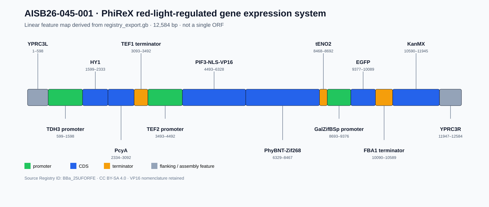
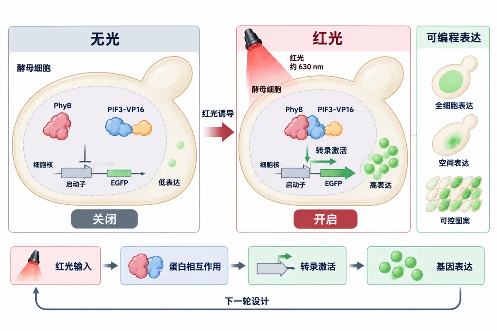
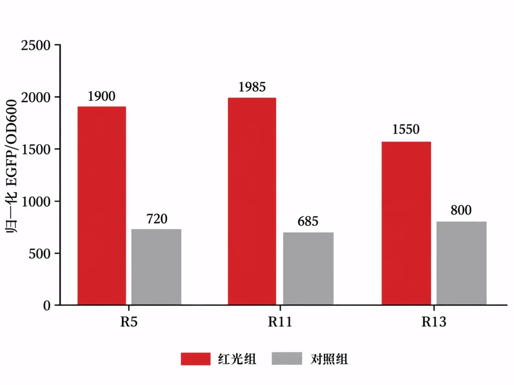
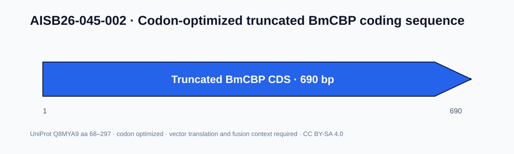
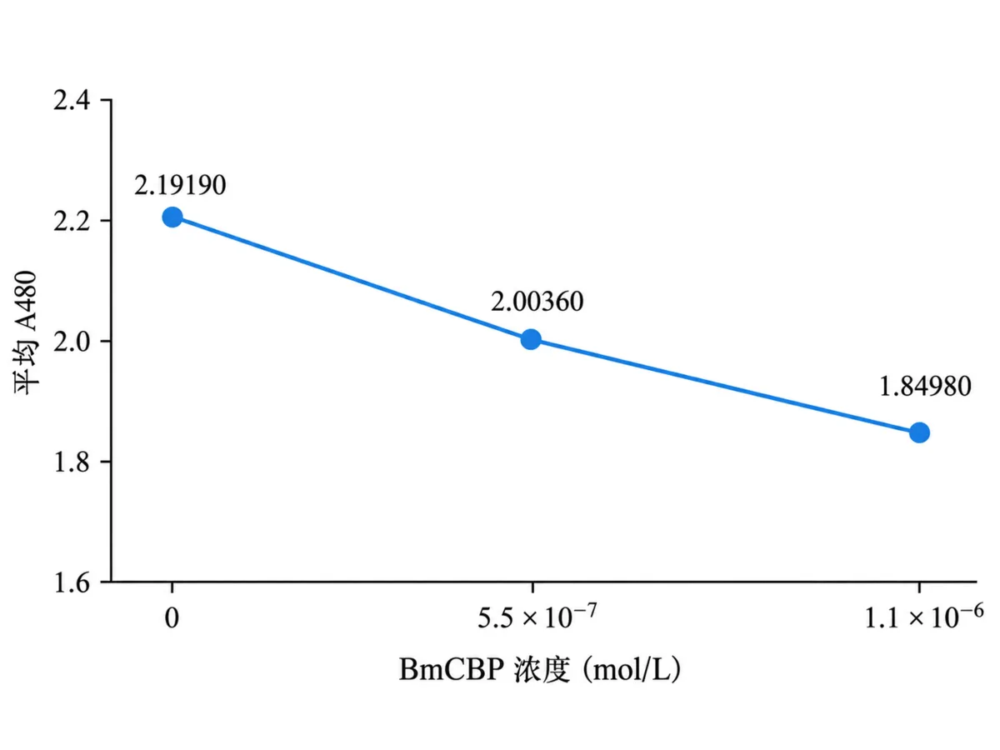

# Parts · 元件库贡献

**BIT-CHINA（045）· 2026 正式提交 2 项经表征 DNA 元件**

`AISB26-045-001 PhiReX` · `AISB26-045-002 BmCBP`

[← Wiki 首页](./Home.md) · [湿实验](./Wet-Lab-Experiments.md) · [干湿结合验证](./Integrated-Validation.md) · [可验证性](./Verifiability.md)

> 两项元件均提供 **FASTA、GenBank、元数据、表征记录和图谱**。FASTA 与 GenBank 的序列一致，来源记录包含元件编号、创建年份、原 Registry 编号和许可信息。

| AISB26 编号 | 名称 | 类型 | 长度 | 主要表征 | 状态 |
|---|---|---|---:|---|---|
| **AISB26-045-001** | PhiReX red-light-regulated gene expression system | Composite Part | **12,584 bp** | 红光 / 无光 EGFP 功能表征 | **已表征，正式提交** |
| **AISB26-045-002** | Codon-optimized truncated BmCBP coding sequence | Basic CDS | **690 bp** | 表达纯化、A480 结合、织物结果 | **已表征，正式提交** |

---

## 1. 元件文件完整性

| 元件 | FASTA | GenBank | 元数据 | 表征记录 | 图谱 | 序列一致性 |
|---|:---:|:---:|:---:|:---:|:---:|:---:|
| **AISB26-045-001** | ✓ | ✓ | ✓ | ✓ | ✓ | **FASTA = GenBank** |
| **AISB26-045-002** | ✓ | ✓ | ✓ | ✓ | ✓ | **FASTA = GenBank；CDS = 1..690** |

完整索引：[`parts/README.md`](../parts/README.md) · 完整性审核：[可验证性](./Verifiability.md#4-元件文件完整性)

---

## 2. AISB26-045-001 · PhiReX 红光调控表达系统

### 2.1 元件图谱

  

<em>PhiReX 线性元件区段图，由当前 GenBank 的区段注释坐标生成，全长 12,584 bp。实心 CDS 通过阅读框检查；虚线区段保留原始位置，按 `misc_feature` 表示。</em>

PIF3-NLS-VP16、PhyBNT-Zif268 保留为 CDS。HY1、PcyA、EGFP、KanMX 按原坐标标为一般区段（`misc_feature`），精确编码边界需由原设计或测序记录确认；DNA 序列保持不变。[原导出、逐区段检查和修订记录](../results/evidence/20260909/phirex_annotation/README.md)。

### 2.2 设计逻辑

PhiReX 为多单元复合调控系统。TDH3 启动子驱动 HY1 与 PcyA，提供 PhyB 光敏色素所需的胆色素合成模块；TEF2 启动子驱动 PIF3-NLS-VP16 与 PhyBNT-Zif268。红光诱导 PhyB 与 PIF3 相互作用，将 VP16 激活结构域定位到 GalZifBSp 启动子邻近区域，从而促进下游 EGFP 表达。

  

<em>PhiReX 红光调控机制示意：约 630 nm 红光促进 PhyB–PIF3-VP16 相互作用，并增强下游转录表达。</em>

元件还包含 YPRC3L、TEF1 终止子、tENO2、FBA1 终止子、KanMX 和 YPRC3R 等结构，共同组成酵母红光调控表达系统。

### 2.3 构建与功能表征

团队使用重叠延伸 PCR 与 Gibson Assembly 完成多片段组装，并以菌落 PCR 和测序记录支持构建结果。

| 参数 | 设置 |
|---|---|
| 宿主 | *Saccharomyces cerevisiae* BY4742 |
| 红光中心波长 | 约 **630 nm** |
| 光强 | **200 μW/cm²** |
| 照射方式 | **2 h 脉冲照射** |
| 总培养时间 | **24 h** |
| 报告基因 | EGFP |
| EGFP 激发 / 发射波长 | `485 / 528 nm` |
| 归一化 | EGFP / OD600 |

原记录图 12 中 R5、R11、R13 三个编号样品在红光条件下均表现出高于无光对照的归一化 EGFP 信号。

  

<em>原记录图 12 的红光/无光 EGFP/OD600 近似图读值。样品编号为 R5、R11、R13；重复类型、n 和误差线定义待原始记录确认，图中不标统计显著性。</em>

原记录图 13 中，R11 与 R13 低于对照；两组图记录分开保存，不合并为重复。

[原记录图 12 与图 13 的数据](../results/evidence/20260909/phirex_annotation/phirex_digitized_records.csv)。R5/R11/R13 对应的构建或克隆身份待原始记录确认。

### 2.4 证据文件

- [`sequence.fasta`](../parts/AISB26-045-001/sequence.fasta)
- [`registry_export.gb`](../parts/AISB26-045-001/registry_export.gb)
- [`metadata.yaml`](../parts/AISB26-045-001/metadata.yaml)
- [`characterization.md`](../parts/AISB26-045-001/characterization.md)
- [`map.svg`](../parts/AISB26-045-001/map.svg)

---

## 3. AISB26-045-002 · 密码子优化的截短 BmCBP 编码序列

### 3.1 元件图谱

  

<em>截短 BmCBP 正式元件图谱：690 bp CDS，对应 UniProt Q8MYA9 aa 68–297。</em>

### 3.2 元件设计

该元件对应 UniProt Q8MYA9 第 68–297 位氨基酸，去除 N 端第 1–67 位预测无序区。CDS 经密码子优化，长度为 **690 bp**。实际表达使用 pET-28a-BmCBP，在 *E. coli* BL21(DE3) 中完成。

后续双层固色方案拟结合 BmCBP 蛋白媒染与壳聚糖物理保护层；这一方案来自产业交流建议。

### 3.3 表达与结合表征

团队完成 IPTG 诱导、Ni-NTA 亲和纯化、SDS-PAGE 和蛋白浓度测定，并将纯化蛋白用于虾青素结合与织物实验。

每个 BmCBP 浓度条件进行 3 次测量：

| BmCBP 浓度（mol/L） | 平均 A480 | 游离虾青素（mol/L） |
|---:|---:|---:|
| 0 | **2.19190** | `1.6×10^-6` |
| `5.5×10^-7` | **2.00360** | `1.4×10^-6` |
| `1.1×10^-6` | **1.84980** | `1.2×10^-6` |

  

<em>BmCBP 浓度与平均 A480 的关系。每条件记录 3 次测量，本图展示保存的条件均值，不附误差线。</em>

平均 A480 与游离虾青素记录随 BmCBP 浓度增加而下降，支持 BmCBP 与虾青素结合。丝绸、棉和聚酯比较进一步支持将丝绸作为当前优先基材。

### 3.4 证据文件

- [`sequence.fasta`](../parts/AISB26-045-002/sequence.fasta)
- [`registry_export.gb`](../parts/AISB26-045-002/registry_export.gb)
- [`metadata.yaml`](../parts/AISB26-045-002/metadata.yaml)
- [`characterization.md`](../parts/AISB26-045-002/characterization.md)
- [`map.svg`](../parts/AISB26-045-002/map.svg)

---

## 4. 溯源与许可

| AISB26 编号 | 原 Registry 编号 | 许可 |
|---|---|---|
| AISB26-045-001 | BBa_25UFORFE | CC BY-SA 4.0 |
| AISB26-045-002 | BBa_251P300A | CC BY-SA 4.0 |

两项元件均由 BIT-China 团队创建，来源、创建与提交年份见元数据、表征记录和贡献说明。元件序列在 AISB26 提交过程中未由 AI 修改；AI 主要用于资料整理、计算分析和文档生成，具体披露见 [项目贡献](./Attributions.md) 与 [AI 伦理与安全](./AI-Ethics-Safety.md)。

---

## 5. 两项元件如何进入 FABRIC 主线

| 元件 | 对应模块 | 项目作用 |
|---|---|---|
| **AISB26-045-001 · PhiReX** | P2 颜色与光控模块 | 用于光控表达表征、光参数选择和硬件控制 |
| **AISB26-045-002 · BmCBP** | P1 材料固色模块 | 用于色素结合、织物实验和固色材料选择 |

两项元件表征均与 [湿实验](./Wet-Lab-Experiments.md) 和 [干湿结合验证](./Integrated-Validation.md) 中的项目结果直接对应。

---

[← Wiki 首页](./Home.md) · [湿实验](./Wet-Lab-Experiments.md) · [干湿结合验证](./Integrated-Validation.md) · [AI / 计算方法](./AI-Computational-Methods.md) · [可验证性](./Verifiability.md)

*最后更新：2026-09-10（文字修订）*
