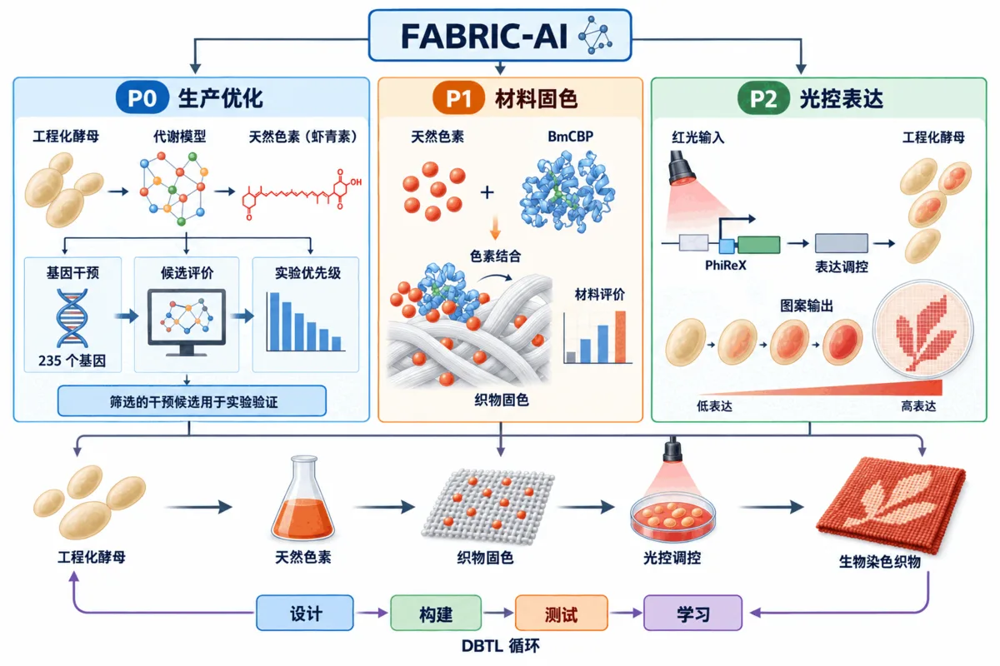

# Project Description · 项目描述

## 1. 项目问题

传统纺织染色通常依赖高耗水、高能耗和多步骤化学处理。生物制造为天然色素生产提供了新的路线，应用于纺织场景需要解决三个问题：**色素产量、织物界面稳定性和可编程图案表达**。

光绘酵染以工程化酵母为生产底盘，以 BmCBP 连接色素与织物，以光控表达和数字投光连接颜色目标与空间图案。FABRIC-AI 进一步把代谢计算、材料实验、光控数据和湿实验反馈组织为统一的设计—验证—学习流程。

  

<em>FABRIC-AI 总体架构：P0 生产优化、P1 材料固色和 P2 光控表达由 DBTL 反馈闭环连接。</em>

---

## 2. P0：Production Optimizer

P0 解决“哪些代谢干预值得进入实验”。Round 0 发酵记录进入 Yeast9/FBA/OptKnock 分析，历史页面记录 307 个候选反应和 14 个方案（Plan1–Plan14）。团队结合代谢通路、文献证据和实验可实施性，确定 `RIB2`、`PAN5`、`MDE1`、`MRI1`、`SPE2`、`FUM1` 六个 Round 1 靶点。

Round 1 发酵结果显示：ΔPAN5 在 120 h 约 `0.67 mg/L`，同批 AST 约 `0.47 mg/L`；ΔMDE1 在 96–120 h 由约 `0.42 mg/L` 降至 `0.36 mg/L`。反馈程序根据终点产量、后期持续性、生物量保持和构建或培养结果评定靶点，确定下一轮安排。

2026 年实现的 Production Optimizer v1.2 分别在葡萄糖主分析条件与乙醇生产阶段条件下评价同一组 235 个候选，并按固定规则排序。近三年公开基线 FastKnock、CFSA、OptEnvelope 与本队方法均在固定共同模型下完成复现与比较。

---

## 3. P1：材料固色模块

P1 解决“如何让天然色素更稳定地连接到织物”。BmCBP 具有类胡萝卜素结合能力，团队以功能分析和分子对接建立候选依据，随后完成截短 BmCBP 的表达、纯化、A480 结合和跨基材验证。

三个 BmCBP 浓度条件各进行 3 次测量，平均 A480 随 BmCBP 浓度增加由 `2.19190` 降至 `2.00360` 和 `1.84980`。丝绸、棉和聚酯的比较用于更新材料优先级，实验结果支持优先研究丝绸。

产业交流进一步推动“BmCBP 蛋白媒染 + 壳聚糖物理保护”的双层固色方向，将色素结合与洗后保护作为后续评价内容。

---

## 4. P2：颜色与光控模块

P2 解决“如何把目标颜色转化为可执行光输入”。系统保存单色、混色、培养物/提取物和基材状态，并将已有颜色记录与光响应参数组织为可查询的候选池。

PhiReX 红光实验采用约 `630 nm`、`200 μW/cm²`、2 h 脉冲照射和 24 h 总培养时间。培养结束后测量 EGFP 荧光（激发/发射波长 `485/528 nm`）与 OD600，原记录图 12 中 R5、R11、R13 三个编号样品在红光条件下均高于无光对照。

硬件将数字图案转换为空间化或时序化光输入，并通过光传感、图形界面、4G 通信和远程参数调整连接培养状态与投光控制。

---

## 5. AI + 合成生物学如何形成闭环

FABRIC-AI 根据计算结果安排实验优先级，再用实验结果调整下一轮设计：

`实验数据 → 模型与候选空间 → 实验优先级 → 湿实验 → 证据等级 → 下一轮设计`

P0 提供完整的设计—构建—测试—学习（DBTL）过程；P1 与 P2 将相同思路扩展到材料接口和光控系统。设计阶段与实验后实验反馈阶段分开保存，分别记录基准比较、实验反馈和后续迭代的依据。

---

## 6. 项目产出

- FABRIC-AI Production Optimizer v1.2 与四方法基准比较；
- Round 0 / Round 1 发酵与反馈规则；
- BmCBP 表达、结合与织物实验；
- PhiReX 红光调控表达系统及其功能表征；
- 数字投光、传感和远程控制硬件接口；
- AISB26-045-001 与 AISB26-045-002 两项正式元件；
- 人类实践、教育与科普和团队合作研究记录。

详细技术设计见 [系统设计](./Design.md)，计算方法见 [AI / 计算方法](./AI-Computational-Methods.md)，实验结果见 [湿实验](./Wet-Lab-Experiments.md)。

---

*最后更新：2026-09-10（文字修订）*
